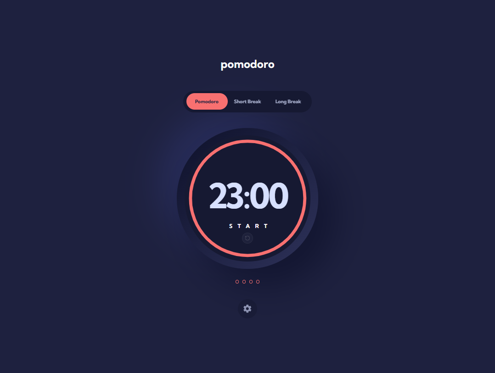
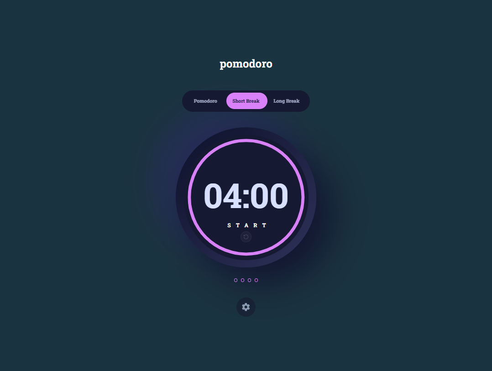
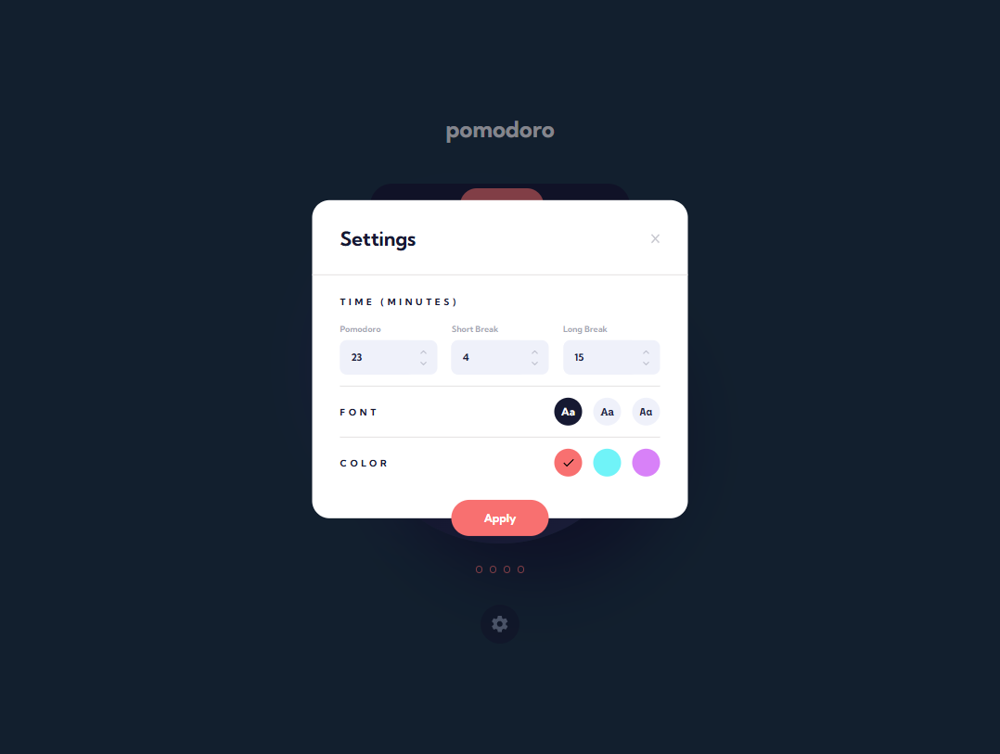

# Pomodoro Timer

A focused, accessible Pomodoro timer built as a progressive web app. Helps you work in structured 25-minute sessions with short and long breaks, tracking your cycle progress with a visual session counter.

**[Live Demo →](https://pomodoro-timer-usechris.vercel.app)**

---

## Screenshots

| Pomodoro | Short Break | Settings |
|---|---|---|
|  |  |  |

---

## Features

- **Three timer modes** — Pomodoro (work), Short Break, and Long Break
- **Visual progress ring** — smooth SVG arc that counts down in real time
- **Session counter** — 4-dot indicator tracks your place in the Pomodoro cycle; resets automatically after a completed Long Break
- **Alarm** — looping audio alert when a session ends; dismiss with one click
- **Customisable settings** — adjust durations, pick from 3 accent colours and 3 fonts; changes apply only on "Apply"
- **Mode-aware background** — the app background subtly shifts colour when you switch modes
- **PWA** — installable on desktop and mobile, works fully offline
- **iOS safe area support** — respects the notch and home indicator in standalone mode
- **Accessibility** — ARIA live regions, `role="alert"` on alarm, `role="tablist"` on mode switcher, `aria-pressed` on timer controls, full `prefers-reduced-motion` support

---

## How to Use

### Starting a session

1. Open the app (or install it — see [Installing as a PWA](#installing-as-a-pwa))
2. The timer defaults to **Pomodoro** mode (25 min)
3. Click **START** to begin the countdown
4. Click **PAUSE** to pause mid-session; click **START** again to resume

### Switching modes

Click any tab in the pill switcher at the top:

| Mode | Default duration | Purpose |
|---|---|---|
| **Pomodoro** | 25 min | Focused work session |
| **Short Break** | 5 min | Quick rest between sessions |
| **Long Break** | 15 min | Longer rest after 4 Pomodoros |

Switching modes resets the current timer and stops any alarm.

### Session counter (the 4 dots)

- Each completed **Pomodoro** fills one dot
- After **4 filled dots** you've completed a full cycle — take a Long Break
- Completing a **Long Break** resets the dots back to zero
- Progress is saved in `localStorage` so a page refresh won't lose your count

### When the alarm fires

- An animated bell notification appears in the top-right corner
- The alarm loops until you dismiss it
- Click the **✕** button on the bell to stop it

### Resetting the timer

Click the small circular **↺** button below the START/PAUSE text to reset the current timer to its full duration without switching modes.

### Customising the app

Click the **⚙** settings icon at the bottom to open the settings panel:

- **Time (minutes)** — set custom durations for each of the three modes (Pomodoro: 5–60 min, Short Break: 2–60 min, Long Break: 5–60 min)
- **Font** — choose from Kumbh Sans, Roboto Slab, or Space Mono
- **Color** — choose from red, cyan, or purple accent colour

Changes only take effect when you click **Apply**.

### Installing as a PWA

**Desktop (Chrome / Edge):**
1. Look for the **Install App** banner that appears at the bottom of the screen
2. Click **Install App**, then confirm in the browser dialog

**Mobile (Android):**
Same as desktop — tap the Install App banner or use the browser's "Add to Home Screen" option.

**iOS (Safari):**
1. Tap the **Share** button in Safari
2. Select **Add to Home Screen**
3. Tap **Add**

Once installed the app runs in standalone mode with full offline support.

---

## Tech Stack

| Layer | Technology |
|---|---|
| Framework | React 18 |
| Language | TypeScript (strict) |
| Build tool | Vite 5 |
| Styling | Tailwind CSS v4.2 (CSS-based config via `@theme`) |
| Animation | Framer Motion |
| State | Context API + `useReducer` |
| PWA | `vite-plugin-pwa` + Workbox |
| Icons | `react-icons` |
| Responsive | `react-responsive` (JS breakpoint for SVG radius calc) |
| Audio | Native `Audio` constructor |

---

## Project Structure

```
src/
├── features/
│   ├── timer/
│   │   ├── components/       # Timer, CircleProgressBar, AlarmBell, SessionCounter
│   │   ├── context/          # TimerContext (useReducer state + actions)
│   │   └── hooks/            # useCountdown (interval, alarm, session logic)
│   │
│   ├── settings/
│   │   ├── components/       # Settings modal, TimeInputForm, FontSelector, ColorSelector
│   │   └── context/          # ColorContext, FontContext, ModalContext
│   │
│   ├── switch/
│   │   └── components/       # Mode switcher tabs with spring animation
│   │
│   └── pwa/
│       ├── components/       # InstallBanner (beforeinstallprompt deferral UI)
│       └── hooks/            # useInstallPrompt
│
├── lib/
│   └── helpers.ts            # getDuration() — converts seconds to MM:SS
│
├── types/
│   └── index.ts              # Shared TypeScript types
│
├── App.tsx                   # Root layout, mode-aware background animation
├── main.tsx                  # Provider tree entry point
└── index.css                 # Tailwind import + @theme design tokens + safe-area utils
```

Each feature is self-contained and exposes its public API through a barrel `index.ts`. Cross-feature imports go through those barrel files — never into a feature's internal subfolders directly.

---

## Running Locally

```bash
# Clone
git clone https://github.com/ChrisOxygen/pomodoro-timer.git
cd pomodoro-timer

# Install dependencies
npm install

# Start dev server
npm run dev

# Type check
npx tsc --noEmit

# Production build (generates PWA service worker)
npm run build

# Preview production build (required to test PWA install prompt & offline)
npm run preview
```

> The PWA service worker and install prompt only activate in the production preview (`npm run preview`), not in dev mode.

---

## Author

**Christopher Okafor**

- Portfolio: [useChris.dev](https://useChris.dev)
- GitHub: [@ChrisOxygen](https://github.com/ChrisOxygen)
- LinkedIn: [christopher-okafor](https://linkedin.com/in/christopher-okafor-17084416b/)
- Twitter / X: [@chris_okafor_x](https://twitter.com/chris_okafor_x)

---

## License

MIT
